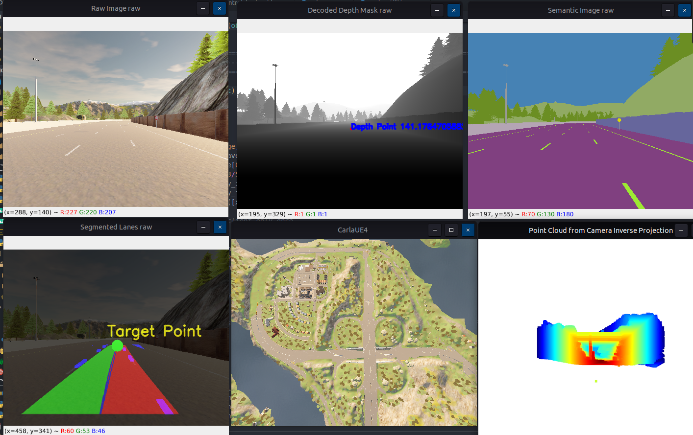
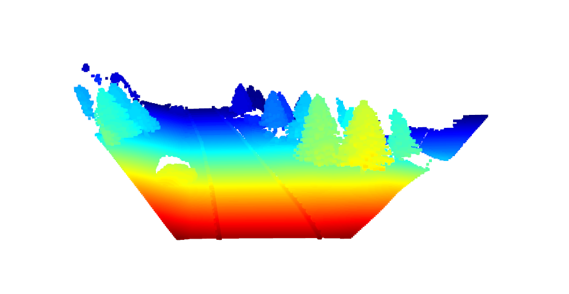

# Carla Simulator Target Point Estimation

Carla project of basic PID and Target Point Estimation from lanes also Inverse Projection Transformation to get point cloud data from RGB image and decoded Depth.



## Description

1- `control_basic_pid`: Basic PID in carla simulator

2- `lane_detection_3d`: Target Point Estimation and Estimation of the 3D location of the target point using the pinhole model in carla simulator

### Executing: Basic PID in carla simulator

In terminal 1: 
```sh
cd ~/PROJECT && conda activate carla
```

In terminal 2:

```sh
cd /opt/carla-simulator && ./CarlaUE4.sh -quality-level=Low -benchmark -fps=5'
```

In terminal 3:
```py

python ./world_simple_init.py

python ./control_basic_pid.py 

```

### Executing: Target Point Estimation and 3D location

In terminal 1: 
```sh
cd ~/PROJECT && conda activate carla
```

In terminal 2:

```sh
cd /opt/carla-simulator && ./CarlaUE4.sh -quality-level=Low -benchmark -fps=5'
```

In terminal 3:
```py

python ./world_simple_init.py

python ./lane_detection_3d.py 

```
## License

This project is licensed under the MIT License
